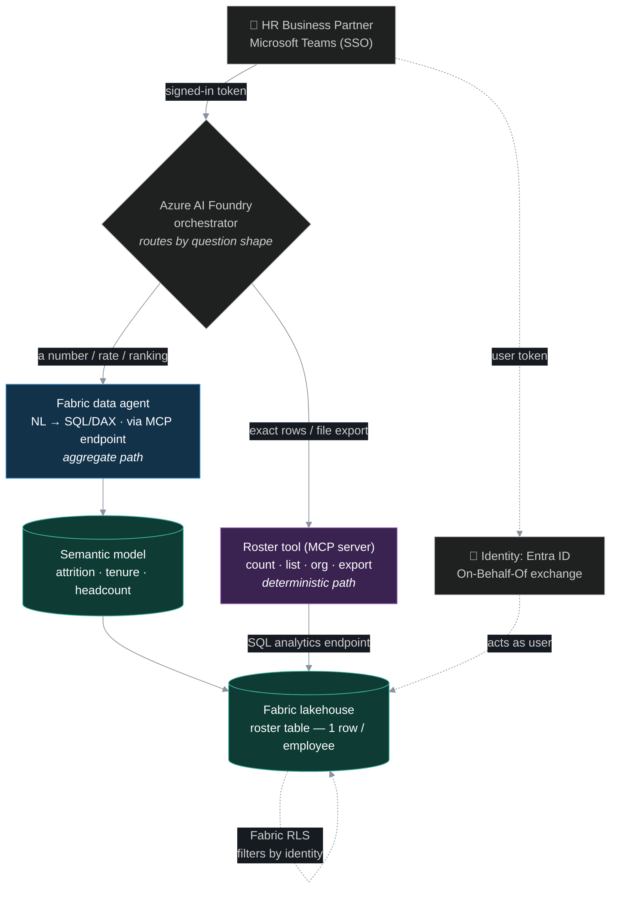

# Architecture
{: .no_toc }

1. TOC
{:toc}

---

## Overview

A user asks a question in **Microsoft Teams**. An **Azure AI Foundry**
orchestrator decides *what shape* the question is and routes it to one of two
retrieval paths: a **Fabric data agent** for aggregate answers, or a
**deterministic roster tool** for exact lists and exports. Both read from
**Microsoft Fabric**, and both enforce the signed-in user's **row-level
security** so the answer only ever contains people that user is allowed to see.

## The pieces

| Component | Role | Product | Local stand-in (this repo) |
|-----------|------|---------|----------------------------|
| **Surface** | Where the user chats | Microsoft Teams with [SSO](https://learn.microsoft.com/microsoftteams/platform/concepts/authentication/authentication) | `demo/` web chat + synthetic persona dropdown |
| **Orchestrator** | Routes each turn to a path; holds the system prompt | Azure AI Foundry agent | `demo/router.py` keyword router + `orchestrator/instructions.md` |
| **Aggregate path** | Turns a question into governed SQL/DAX; returns a number | [Fabric data agent](https://learn.microsoft.com/fabric/data-science/concept-data-agent), [consumed in Foundry via its MCP endpoint](https://learn.microsoft.com/azure/foundry/agents/how-to/tools/fabric) | `demo/data_agent.py` computes golden metrics from the seed |
| **Deterministic path** | Exact list / count / org-walk / **file export** | Roster tool — a custom **MCP server** over parameterized SQL | `roster_mcp/` against SQLite (fully built) |
| **Data** | Employees + people metrics | Fabric **lakehouse** table + **semantic model** | `data/hr_local.db` (SQLite) auto-seeded from committed synthetic CSV |
| **Identity & security** | Per-user scoping | Entra ID + [On-Behalf-Of](https://learn.microsoft.com/entra/identity-platform/v2-oauth2-on-behalf-of-flow) → [Fabric row-level security](https://learn.microsoft.com/fabric/data-warehouse/row-level-security) | `auth_obo.py` scope shim over an `hr_access` map |

## Why two paths (routing)

The orchestrator picks a path from the *shape* of the question, not keywords:

- **Fuzzy / aggregate** → Fabric data agent. "What's the attrition rate in
  EMEA?", "Which team has the highest turnover?" The answer is a number and the
  exact rows don't matter — and the data agent
  [caps responses at 25 rows](https://learn.microsoft.com/fabric/data-science/concept-data-agent#limitations),
  which is fine for a rate.
- **Exact list / count / export** → roster tool. "List active employees on the
  Azure Data team", "Export my region's roster." These must be exact,
  reproducible, and can run to thousands of rows in a file — beyond what the
  data agent returns.
- **Mixed** ("show EMEA attrition *and* the list of who left") → run **both**
  and present each result.

The routing contract lives in [`orchestrator/instructions.md`](https://github.com/ericchansen/agent-demo-hr/blob/main/orchestrator/instructions.md)
and is exercised by the [demo script](demo-script.html).

## Row-level security (the core control)

RLS is enforced **server-side, on every tool call**, and is the same behavior
locally and in the cloud — only the mechanism changes:

1. **Identity is resolved before the tool call**, never passed as a tool
   parameter. The MCP surface deliberately exposes no `scope` override. The
   local web demo intentionally lets its operator choose a synthetic persona;
   that selector is a demonstration shim, not authentication.
2. **Scope is always AND-ed into the query.** The caller's allowed region/team
   is appended to every `WHERE` clause (`roster_mcp/db.py::build_where`).
3. **Fail closed.** An unknown user resolves to an impossible scope → zero rows,
   with no special-case branch.
4. **Injection boundary.** Only code-owned column *names* are ever interpolated
   into SQL; user-supplied *values* are always bound as parameters
   (`roster_mcp/queries.sql`).
5. **Sensitive-attribute gating.** Roster output is a fixed allow-list that
   excludes compensation, performance, and demographics.

The demonstration of this — two personas, identical question, provably disjoint
rowsets — is the [demo script](demo-script.html)'s money-shot and is asserted 100%
in `orchestrator/eval/run_eval.py`. See the [Threat model](threat-model.html) and
[Identity & RLS flow](identity-flow.html) for the full picture.

In production, [Fabric RLS](https://learn.microsoft.com/fabric/data-warehouse/row-level-security)
keyed to the [On-Behalf-Of](https://learn.microsoft.com/entra/identity-platform/v2-oauth2-on-behalf-of-flow)
token becomes authoritative and the local `hr_access` emulation falls away.

## Inside the roster tool

A small [MCP](https://modelcontextprotocol.io) server exposing five read-only
tools, each of which applies the caller's scope before touching data:

| Tool | Purpose |
|------|---------|
| `get_roster_schema` | Distinct teams/orgs/regions you're allowed to filter on |
| `count_roster` | Headcount for a filter (scoped) |
| `list_roster` | Capped, in-context list of matching employees |
| `list_org_under` | Recursive org-tree walk under a manager |
| `export_roster` | **Streams the full in-scope result to a CSV/XLSX file** — the answer to the data agent's row cap; excludes sensitive columns |

`list_roster` is intentionally capped for chat-context safety; `export_roster`
is uncapped and streamed to a file precisely because the real workload is
"give me all several-thousand of them as a spreadsheet."

## From local scaffold to cloud

This repo builds the **tenant-free slice**: SQLite stands in for Fabric SQL, an
env-var identity shim stands in for the OBO exchange, and a local file stands in
for a Blob + SAS download. The tool contracts and the RLS *behavior* are
designed to survive the swap unchanged — only the data source and the identity
mechanism move.

- **[Local → cloud mapping](production-mapping.html)** — each piece and its
  production counterpart.
- **[Current limitations](preview-limitations.html)** — exactly what is stubbed
  and why.
- **Data model** — [`data/schema.md`](https://github.com/ericchansen/agent-demo-hr/blob/main/data/schema.md).
